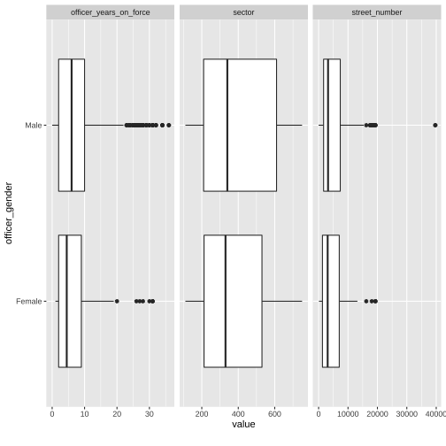
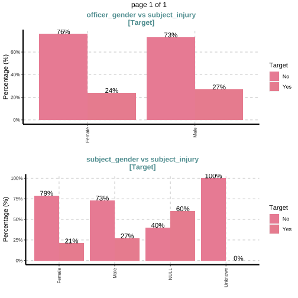

# Dataset Description

The dataset provided by Dallas Police department involves the details related to Subject in incidents. The injuries may happen during this course which is also reported. The other details given are Officer and subject race, gender, Officer force type etc. The basic aim of the given data is to analyse the research question if there is any Race effect on the arrests and other crime related incidents involving both parties. We will analyse this question with the help of steps below. 

First of all we load the csv file and clean the column alongwith removing columns without any value. 

```r
df <- read.csv("~/Documents/R_data_Visualizations/37-00049_UOF-P_2016_prepped.csv",na.strings = c("")) %>%  clean_names() %>% remove_empty()
```


# Overview of data

We can get an overview of the our dataset with the help of `head` function. It gives us important information about the data types of variables in the dataset which can help to determine what variables we should keep. The information from this very initial step can help for EDA analysis. 
 
ref: 

```r
head(df)
```

```
##   incident_date incident_time    uof_number officer_id officer_gender officer_race
## 1    OCCURRED_D    OCCURRED_T        UOFNum CURRENT_BA         OffSex      OffRace
## 2        9/3/16    4:14:00 AM         37702      10810           Male        Black
## 3       3/22/16   11:00:00 PM         33413       7706           Male        White
## 4       5/22/16    1:29:00 PM         34567      11014           Male        Black
## 5       1/10/16    8:55:00 PM         31460       6692           Male        Black
## 6       11/8/16    2:30:00 AM  37879, 37898       9844           Male        White
##   officer_hire_date officer_years_on_force officer_injury          officer_injury_type
## 1           HIRE_DT    INCIDENT_DATE_LESS_     OFF_INJURE              OFF_INJURE_DESC
## 2            5/7/14                      2             No No injuries noted or visible
## 3            1/8/99                     17            Yes                Sprain/Strain
## 4           5/20/15                      1             No No injuries noted or visible
## 5           7/29/91                     24             No No injuries noted or visible
## 6           10/4/09                      7             No No injuries noted or visible
##   officer_hospitalization subject_id subject_race subject_gender subject_injury
## 1              OFF_HOSPIT     CitNum      CitRace         CitSex     CIT_INJURE
## 2                      No      46424        Black         Female            Yes
## 3                     Yes      44324     Hispanic           Male             No
## 4                      No      45126     Hispanic           Male             No
## 5                      No      43150     Hispanic           Male            Yes
## 6                      No      47307        Black           Male             No
##            subject_injury_type subject_was_arrested subject_description
## 1             SUBJ_INJURE_DESC           CIT_ARREST          CIT_INFL_A
## 2      Non-Visible Injury/Pain                  Yes   Mentally unstable
## 3 No injuries noted or visible                  Yes   Mentally unstable
## 4 No injuries noted or visible                  Yes             Unknown
## 5               Laceration/Cut                  Yes FD-Unknown if Armed
## 6 No injuries noted or visible                  Yes             Unknown
##            subject_offense reporting_area beat sector      division location_district
## 1               CitChargeT             RA BEAT SECTOR      DIVISION         DIST_NAME
## 2                    APOWW           2062  134    130       CENTRAL               D14
## 3                    APOWW           1197  237    230     NORTHEAST                D9
## 4                    APOWW           4153  432    430     SOUTHWEST                D6
## 5           Evading Arrest           4523  641    640 NORTH CENTRAL               D11
## 6 Other Misdemeanor Arrest           2167  346    340     SOUTHEAST                D7
##   street_number  street_name street_direction street_type
## 1      STREET_N       STREET         street_g    street_t
## 2           211        Ervay                N         St.
## 3          7647     Ferguson             NULL         Rd.
## 4           716 bimebella dr             NULL         Ln.
## 5          5600          LBJ             NULL       Frwy.
## 6          4600    Malcolm X                S       Blvd.
##   location_full_street_address_or_intersection location_city location_state location_latitude
## 1                               Street Address          City          State          Latitude
## 2                               211 N ERVAY ST        Dallas             TX         32.782205
## 3                             7647 FERGUSON RD        Dallas             TX         32.798978
## 4                             716 BIMEBELLA LN        Dallas             TX          32.73971
## 5                               5600 L B J FWY        Dallas             TX              <NA>
## 6                        4600 S MALCOLM X BLVD        Dallas             TX              <NA>
##   location_longitude incident_reason reason_for_force   type_of_force_used1
## 1          Longitude      SERVICE_TY       UOF_REASON            ForceType1
## 2         -96.797461          Arrest           Arrest Hand/Arm/Elbow Strike
## 3         -96.717493          Arrest           Arrest           Joint Locks
## 4          -96.92519          Arrest           Arrest     Take Down - Group
## 5               <NA>          Arrest           Arrest        K-9 Deployment
## 6               <NA>          Arrest           Arrest        Verbal Command
##   type_of_force_used2 type_of_force_used3 type_of_force_used4 type_of_force_used5
## 1          ForceType2          ForceType3          ForceType4          ForceType5
## 2                <NA>                <NA>                <NA>                <NA>
## 3                <NA>                <NA>                <NA>                <NA>
## 4                <NA>                <NA>                <NA>                <NA>
## 5                <NA>                <NA>                <NA>                <NA>
## 6     Take Down - Arm                <NA>                <NA>                <NA>
##   type_of_force_used6 type_of_force_used7 type_of_force_used8 type_of_force_used9
## 1          ForceType6          ForceType7          ForceType8          ForceType9
## 2                <NA>                <NA>                <NA>                <NA>
## 3                <NA>                <NA>                <NA>                <NA>
## 4                <NA>                <NA>                <NA>                <NA>
## 5                <NA>                <NA>                <NA>                <NA>
## 6                <NA>                <NA>                <NA>                <NA>
##   type_of_force_used10 number_ec_cycles force_effective
## 1          ForceType10       Cycles_Num      ForceEffec
## 2                 <NA>             NULL             Yes
## 3                 <NA>             NULL             Yes
## 4                 <NA>             NULL             Yes
## 5                 <NA>             NULL             Yes
## 6                 <NA>             NULL         No, Yes
```


Table.  1
# EDA Analysis

EDA analysis is an important step for this assignment. We have many data types in our dataframe from characters to double. We will convert the data types to factors and numeric. It will help in data visualization. 

At first we get the shape of the data set by `dim` function.


```r
dim(df)
```

```
## [1] 2384   47
```

The first row is an extra with same names as the datframe. We removed by using in code chunk below. 

We also use `attach` function of base R which will help to call dataset variables without using the basic $ sign each time. 


With the help of Exp Data function we can have a closer look into variables types and other important details of the dataset.


```r
library("SmartEDA")
ExpData(data=df,type=1)
```

```
##                                           Descriptions      Value
## 1                                   Sample size (nrow)       2383
## 2                              No. of variables (ncol)         47
## 3                    No. of numeric/interger variables          0
## 4                              No. of factor variables          0
## 5                                No. of text variables         47
## 6                             No. of logical variables          0
## 7                          No. of identifier variables          0
## 8                                No. of date variables          0
## 9             No. of zero variance variables (uniform)          4
## 10               %. of variables having complete cases 76.6% (36)
## 11   %. of variables having >0% and <50% missing cases  4.26% (2)
## 12 %. of variables having >=50% and <90% missing cases  2.13% (1)
## 13          %. of variables having >=90% missing cases 17.02% (8)
```

The above overview is also given below with data types in each column.


```r
library(skimr)
datatable(skim(df))
```

```
## Error in path.expand(path): invalid 'path' argument
```


There are some values in the dataset which will removed periodically in data visualization instead of removing them row by row here.

From the table above we conclude that almost all variables are of data type `character` which is not helpful for the data analysis via visualization such as boxplot so we will convert the character to factors and dbl to numeric in chunk below. 


```r
df <-  lapply(df, as.factor) %>% data.frame()

df$officer_years_on_force <- as.numeric(as.character(df$officer_years_on_force))

df$street_number <- as.numeric(as.character(df$street_number ))
df$sector <- as.numeric(as.character(df$sector))
```


After getting overall view of the data let's check the measure of central tendency. It will help to determine and introduce the data statistically. 


```r
diagnose_numeric(df)
```

```
## # A tibble: 3 × 10
##   variables                min    Q1    mean median    Q3   max  zero minus outlier
##   <chr>                  <dbl> <dbl>   <dbl>  <dbl> <dbl> <dbl> <int> <int>   <int>
## 1 officer_years_on_force     0     3    8.05      6    10    36     3     0     240
## 2 sector                   110   210  389.      350   610   750     0     0       0
## 3 street_number              0  1700 4904.     3415  7532 54023     1     0      58
```

Some columns will be removed which has large number of `NaN` 


```r
df <- df %>% select(-c("uof_number",matches("used")))
```


The outliers can also eb detected with boxplots. 


```r
df %>% filter(subject_gender==c("Male","Female"))%>% 
plot_boxplot(., by ="officer_gender")
```



We observe that most outliers related to male officers with several years of service. Moreover the average service of officers from both genders is less than 10 years. 


With regards to the factor variables such as `officer_injury_type' we can have detailed description of each incident separately. At first we start with the duplicates detection. 

```r
p <- df %>% get_dupes(officer_injury_type)%>%  ggboxplot(x="officer_injury_type",y="dupe_count",color="officer_gender", add="jitter")+theme(axis.text.x = element_text(angle = 90, size = 5))+scale_alpha(0.5)+
ylim(0, 100)
ggplotly(p)
```

```
## Error in path.expand(path): invalid 'path' argument
```
We observe that most of duplicates are the `No innjuy` for both officer genders. Similar observation can be checked for subjects which shows the similar trend althought the duplicates for abrasive injuries for subjects are higher. 


```r
p <- df %>% get_dupes(subject_injury_type)%>% filter(subject_gender!=c(NULL,"Unknown")) %>%  ggboxplot(x="subject_injury_type",y="dupe_count",color="subject_gender", add="jitter")+theme(axis.text.x = element_text(angle = 90, size = 5))+ylim(0, 100)

ggplotly(p)
```

```
## Error in path.expand(path): invalid 'path' argument
```

We can find the number of incidents for time period of each race separately by using `tabyl` function. 


```r
datatable(tabyl(df,incident_time,subject_race) %>%  select(-NULL))
```

```
## Error in path.expand(path): invalid 'path' argument
```

We observe that most incidents are occurring late night and in the morning around 9AM. 

Furthermore we can find a summary statistics of categorical variables. We can run several test on the input categorical variables such as `chi-square` test. The p-value which is basically a statistical check to analyse if there exist significant difference between variables at commonly chosen 5% significance level. 

The table generated from the  code chunks gives us many insights into the dataset. None of the variables is predictive enough to give us major result about dataset as shown in last column. Althought the p-values are less than 0.05 yet the degree of association is very weak between categorical variables in our dataset as shown by result of chi-square test. 


```r
p <-  datatable(ExpCatStat(df,Target="subject_race",result = "Stat",clim=10,nlim=5,Pclass="Yes"))

p
```

```
## Error in path.expand(path): invalid 'path' argument
```

Graphical representation for categorical varaibles in given below. 


```r
ExpCatViz(df,target="officer_race",fname=NULL,clim=10,col=NULL,margin=2,Page = c(2,1),sample=2)
```

```
## $`0`
```


```r
ExpCatViz(df,target="subject_injury",fname=NULL,clim=10,col=NULL,margin=2,Page = c(2,1),sample=2)
```

```
## $`0`
```


Above 2 figures show that the percentage of officer getting injury during incidents are high as they are in large percentage in total count of officers. The percentage of injury hispanic officers is almost equal at 19% and 20%. On the other hand there 15% chance of asian officers not able to arrest the subject. Officers are also most likely to be hospitalized alongwith subjects in the incidents involving unfavorable conditions. 


We can find the correlation between variables as well which gives results in the form of correlation coefficent. The results show that none of numeric variables are strongly correlated with each other.  


```r
correlate(df)
```

```
## # A tibble: 6 × 3
##   var1                   var2                   coef_corr
##   <fct>                  <fct>                      <dbl>
## 1 sector                 officer_years_on_force    0.0182
## 2 street_number          officer_years_on_force    0.0410
## 3 officer_years_on_force sector                    0.0182
## 4 street_number          sector                    0.183 
## 5 officer_years_on_force street_number             0.0410
## 6 sector                 street_number             0.183
```

The above tabular corelation data can be shown in graphical form.

```r
 df %>% 
  correlate() %>%
  plot()
```


The skewness check of numeric variables is given below. 

```r
find_skewness(df)
```

```
## [1]  7 24
```

```r
find_skewness(df, index = FALSE)
```

```
## [1] "officer_years_on_force" "street_number"
```

```r
find_skewness(df, value = TRUE)
```

```
## officer_years_on_force                 sector          street_number 
##                  1.484                  0.268                  2.313
```

So the major numeric variables of on duty years is skewed which need to analysed to remove skewness. Other 2 variables can be reject for skewnss removal since they do not weigh much in the analysis.


Following graphs shows that the officers with more service years are used for crowd control in the department. Furthermore there is very high chance of use of force when subject has weapons. Senior officers will go for severe levels of use of force when the subject is black as shown in boxplot with green fill. 

```r
p <- df %>%
 filter(!(subject_race %in% "NULL")) %>%
 filter(!(reason_for_force %in% "NULL")) %>%
 ggplot() +
 aes(x = officer_years_on_force, y = reason_for_force, fill = subject_race) +
 geom_boxplot() +
 scale_fill_hue(direction = 1) +
 ggthemes::theme_base()+theme(legend.position = "bottom")

ggplotly(p)
```

```
## Error in path.expand(path): invalid 'path' argument
```

The chart given below shows that males subjects mostly undergo use of force during arrest as compared to their counterparts. Similar trend is observed for for almost all cases of use of force with more proportion towards males class. 

```r
df1 <- df %>% select(subject_gender,reason_for_force,officer_gender)

p <- df1 %>%
 filter(subject_gender %in% c("Female", "Male")) %>%
 filter(!(reason_for_force %in% "NULL")) %>%
 ggplot() +
  aes(x = reason_for_force, fill = subject_gender) +
  geom_bar(position = "dodge") +
  scale_fill_hue(direction = 1) +
  coord_flip() +
  theme_minimal()

ggplotly(p)
```

```
## Error in path.expand(path): invalid 'path' argument
```

# Summary 

Data Analysis is conducted for the Dallas, USA Police enquity dataset in view of the racial recognition effects. The analysis shows that major portion of both classes of officer genders can go uninjured during incidents while this is not the case of subjects. Black race subjects are involved in high percentage in the incidents followed by hispanics. Statistical analysis of categorical varaibles show that there is variable which can serve as predictve variable. Similarly, the male officers, which consist of more 70% of officers in service, can have skewness in their data on the basis of service years. Normality of dataset was checked which gave us a p-value < 0.05 at 95% confidence level. The corelation matrix shows that none of numeric variables is correlated to each other. The statistical tables show that asian officers have less chance of completing arrests in incidents as compared to white police officers. 


