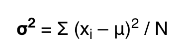

# Part 1

## Question a

The health department Dataframe named \``Q1.df` has columns related to
weight of participants in several months. In this question we are
required to select 15 participants for the feb data with replacement
technique so we use the `sample` function of R as follows

```{r setup, include=FALSE}
knitr::opts_chunk$set(echo = TRUE,warning = F,message = F,include = T)
```

```{r}
library(tidyverse)
library(dplyr)
library(caret)
library(rstatix)
```

```{r}
load(file='AssignmentData (13).RData')


df1 <- Q1.df %>% select(ExerciseFeb,WeightFeb) 

df1 <- df1[sample(1:nrow(df1), size=15, replace=T), ]
```

Further we require the 10 participants for calculating the probability
that they are exercising for more than 2 days/week so we can use n=10
for probability calculation. We know that out of 15 participants 10 are
selected which is approx 66% of total population so we use p=0.66 for
our calculation. It can be written as P(X>2)=1−P(X≤2) = 1-
pbinom(2,size,prob) where size = 15 for us with n=10. This is done in
the code below.

```{r}
#library(prob)
pbinom(2,15,0.66,lower.tail=FALSE)

```

It means that there is 0.99 probability that the participants have gone
for exercise for 2 days/week.

## Question b

For this question we can use the replace=F for subsampling. Note that we
have size=10 as given in statement of the question for selection of 10
participants out of month febrary.

```{r}

df1 <- Q1.df %>% select(ExerciseFeb,WeightFeb)
df1 <- df1[sample(1:nrow(df1), size=10, replace=F), ]

```

For calculating probabilities we can use the pbinom function again where
the question is "find the probability that either 2 or 3 participants
exercised more than 4 days each week." It can written as P(2∪3) = P(2) +
P(3) -- P(2∩3) where 2 and 3 are participants out of 10.

```{r}

sum(pbinom(2:3,10,0.57))

#pbinom(10,15,0.66,lower.tail=FALSE)
```

Here the probability is 0.1 for the participants to go for exercise for
more than 4 days in a week.

## Question c

The porportion of population who weigh more than 99kg is calculated by
selecting those people who weight is more than 99 kg and it can done by
`filter` function.

For this purpose we given 2 hypothesis as 
- **Null hypothesis H0:** The proportion of people more than 99kg are more than 0.015 of total population going for exercise in feb 
- **Alternate hypothesis H1:** The
proportion of people more than 99kg are less than 0.015 of total population going for exercise in feb. We will test the hypothesis by simple row selection at 2.5% significance level.

```{r cars}
df1 <- Q1.df %>% select(ExerciseFeb,WeightFeb) %>%  filter(WeightFeb>99) %>% count()

df1
```

It shows that there are only 6 persons who weigh more than 99kg and
their percentage in population is given by

```{r}
nrow(df1)/nrow(Q1.df)
```

Which is less than given value of 0.015 hence we reject our null
hypothesis and accept the alternate hypothesis.

## Question d

- **Null hypothesis H0**: Proportion of people who exercise 3 or 6 days a
week are less in March as compared to feb 
- **Alternative hypothesis H1**:
Proportion of people who exercise 3 or 6 days a week are more in March
as compared to feb

```{r}
df1 <- Q1.df %>% select(3) %>% filter(ExerciseFeb %in% c("Three","Six"))


df <- Q1.df %>% select(5) %>% filter(ExerciseMar %in% c("Six","Three"))

print(paste("Number of participants ddoing exercise for six or three days in feb are    ",nrow(df1)))
print(paste("Number of participants ddoing exercise for six or three days in March are ",nrow(df)))

```

So the results show that there are more participants in march as
compared to feb for our criteria hence we reject our null hypothesis at
significance level of 10%.

# Part 2

## Question (a)

It is a choice to select one of two cities so we firstly we select the data of Canberra from year 2002.

```{r}
df1 <- Q2.df %>% select(3,4) %>% filter(City2002 %in% c("Canberra"))
```


Afterwards we check the normality of the dataset by Shapiro wilk test which is a requirement for all t-tests. 

```{r}
shapiro_test(df1$AvgGrade2002)
```

We observe that p-value is >0.05 at significance level of 5% as given in question which shows that our data is normal. We proceed towards 1-sample t-test and define our 2 hypothesis as 
- *Null hypothesis H0*: Population Mean
score for Canberra is not greater than 70 
- *Alternate hypothesis H1*: Population Mean score for Canberra is
greater than 70

We can calculate the mean score, variance and other required variables as below

```{r}
# mean of sample
mean <- mean(df1$AvgGrade2002)

var <- var(df1$AvgGrade2002)

#theorotical mean of population 
mean_of_pop <- mean(Q2.df$AvgGrade2002)

# standard deviation of sample
stand <-  sd(df1$AvgGrade2002)
# sample size
row <-  nrow(df1)

t_1_sample_test <- (mean - mean_of_pop)/stand/sqrt(row)
t_1_sample_test
```


We observe that p-value is less than 0.05 so we reject our null hypothesis that population mean of scores of Canberra city students in 2002 is greater than 70 and there exists significant difference between avg score of 70 and avg score of Canberra city students.

## Question (b)

We have been given population variance here of 64 for all cities. We have to test the population mean average of student scores from 2 cities so we define our hypotheses as;

- *H0:* Population mean average grade of Sydney students is higher than students from Canbera by 0.1
- *H1:* Population mean average grade of Sydney students is not higher than students from Canbera by 0.1

Here we need to compare population means for two groups so we can use independent sample t-test at significance level (alpha) of 5%. 

Before the t-test we need to use the shapiro wilk test to check normality of data. We will do it for both cities according to requirement of the question. 

```{r}

df1 <- Q2.df %>% filter(City2002=="Sydney") %>% select(AvgGrade2002) 


shapiro_test(df1$AvgGrade2002)


```

```{r}
df2<- Q2.df %>% filter(City2002=="Canberra") %>% select(AvgGrade2002) 

shapiro_test(df2$AvgGrade2002)
```
The p-value is <0.05 for Sydney data as compared to Canberra where p-value is >0.05 so both the sample datasets are different from each other, hence we cannot compare the means of the two datasets according to independent t-test which is based on the assumption that the two independent samples are normally distributed. 

In this scenario, we can move towards Wilcoxon Rank sum test which doesn't require the normality of data in 2 independent groups with same variance. 


## Question (c)

This question requires the testing for population variance ($/sigma^2$) for two cities Melbourne and Perth. The variance is given by formula 




For the analysis we firstly get the subset of data from main dataset. 

```{r}
df1 <-  Q2.df %>% filter(City2002 == "Melbourne")
df2 <-  Q2.df %>% filter(City2002 == "Perth")

```


We need to check the normality of our datasets before hand

```{r}
shapiro_test(df1$AvgGrade2002)
```
```{r}
shapiro_test(df2$AvgGrade2002)
```

In both cases the p-value is greater than alpha = 0.01 which is our chosen significance level, therefore we move towards F-test for comparison of variances. 
The hypothesis for the tests are;
- *null hpothesis H0* The variance of avg grades of students of Melbourne and perth is equal 
- *Alternate hypothesis H1* The variance of avg grades of students of Melbourne and perth is not equal


It includes calculation of variances individually and dividing them.

```{r}

#σ2 = ∑ (Xi – μ)2 / N
var1 <- sum((df1$AvgGrade2002-mean(df1$AvgGrade2002))^2)/length(df1$AvgGrade2002)
var2 <- sum((df2$AvgGrade2002-mean(df2$AvgGrade2002))^2)/length(df2$AvgGrade2002)


F_test <-  var1/var2
F_test
```

The result of the F-test shows that p-value is much greater than our significance level of 0.01 so we conclude that the variance of two groups are statistically significant from each other and we accept our alternate hypothesis.


## Question (d)


In this question we are again using the dataset from previous question so the hypothesis with a little change can be written as

- *H0:* mean avg grade for perth students is equal to Melbourne students
- *H1:* mean avg grade for perth students is not equal to Melbourne students


This can be tested with the help of welch t-stats since their variance is different  at alpha=10% as follows
```{r}

# mean of 2 groups from perth and melbourne 
mean1 <-  mean(df1$AvgGrade2002)
mean2 <- mean(df2$AvgGrade2002)

#standard deviation of 2 groups
var1 <- sd(df1$AvgGrade2002)
var2 <-  sd(df2$AvgGrade2002)

t <- mean1 - mean2/sqrt((var1^2/nrow(df1))+(var2^2/nrow(df2)))
t


```

The p-value is very much higher than chosen significance level of 0.1 so we reject our null hypothesis that there is mean of perth and melbourne student scores are equal. 

## Question (e)

{Test whether the population mean average grade for students is the same for all five cities. Clearly state your hypotheses and use a significance level of α = 5%. Do not use any R functions that are designed to perform hypothesis tests or to perform, analyse or interpret an ANOVA.
}
In this question we can compare all five cities with the help of ANOVA test since it involves more than 2 groups. We can write our hypothesis as 

* *H0:* There is no significant difference between means of avg score of all 5 cities 
* *H1:* There is significant difference between means of avg score of all 5 cities 

It is important to check the normality of dataset before conducting parametric tests. The significance level is 5% here. 


```{r}
df1 <-  Q2.df %>% select(2,4,6,8,10) 

shapiro_test(df1$AvgGrade2001,df1$AvgGrade2002,df1$AvgGrade2003,df1$AvgGrade2004,df1$AvgGrade2005)
```

The overall p-value is greater than alpha so our data is normaly distributed. 

The one-way ANOVA test can be done as following

SSB = Σ(Xi – Xt)² 
where Xi is mean of group i and Xt is mean of all the observations.

```{r}
mea <- mean(sum(colMeans(df1)))
SSB <-  sum((mean(df1$AvgGrade2001)-mea)^2+
              (mean(df1$AvgGrade2002)-mea)^2+
              (mean(df1$AvgGrade2003)-mea)^2+
              (mean(df1$AvgGrade2004)-mea)^2+
              (mean(df1$AvgGrade2005)-mea)^2)


# dgress of freedom since we have 5 groups so
dfb  <-  5-1

# DFw = degrees of freedom = N – K where K is the number of group, and N is total number of observations in all the group

DFw <- nrow(df1) - 5

# SSW = Σ(Xij – Xj)² where Xij is the observation of each group j

SSW <-  sum(
  sum(df1$AvgGrade2001-mean(df1$AvgGrade2001))^2+
     sum(df1$AvgGrade2002-mean(df1$AvgGrade2002))^2+
           sum(df1$AvgGrade2003-mean(df1$AvgGrade2003))^2+
                 sum(df1$AvgGrade2004-mean(df1$AvgGrade2004))^2+
                       sum(df1$AvgGrade2005-mean(df1$AvgGrade2005))^2)

SST <-  sum(
 (df1$AvgGrade2001-mea)^2+(df1$AvgGrade2002-mea)^2+(df1$AvgGrade2003-mea)^2+(df1$AvgGrade2004-mea)^2+(df1$AvgGrade2005-mea)^2
)

MSB <-  SSB/dfb
MSE <-  SSW/DFw 

f_stat <- MSB/MSE
f_stat


```

The F-statistics  value is very large which means that there is significant difference between means of all cities avg score. 

##Question (f)

ANOVA test results indicates that there is statiscally significant difference between the means of all groups in our dataset. The F-value output from ANOVA test indicates that we should accept or reject our value  and it is governed by the table of F_stats. This table depends upon degrees of freedom which is 4 in our case and corresponding F_test value is 6.3882 so the rule is if F>6.38 reject null hypothesis. 


# Part 3

## Question (a)


For the analysis we select the data from Cholestrol50 and 52 as given. 

```{r}
df1 <- Q3.df %>% select(Cholesterol50,Cholesterol52)
```

Scatter plot for 2 variables is given below

```{r}

#plot(x='Cholesterol50',y='Cholesterol52',type='l')

ggplot(df1) +
 aes(x = Cholesterol50, y = Cholesterol52, size = Cholesterol52) +
 geom_point(shape = "square open", 
 colour = "#112446") +
 geom_smooth(span = 0.75) +
 labs(subtitle = "Cholesterol Trend between People aged 50 and 52", 
 size = "Cholesterol level") +
 ggthemes::theme_base()

```

We observe that cholesterol levels in the people aged 50 and 52 have almost linear relationship with each other. There are some cases with level of cholesterol in both categories as shown by size legend in the figure above. Although the cases with level from less than 4.8 are present in both age groups yet the cholestrol levels in age group 52 is higher as compared to group 50. 

## Question (b)
At Significance level of 5% we can test the following hypothesis.

* *H0:* There exists significant difference between mean values of cholestrol for age group 50 and 52
* *H1:* There is no significant difference between mean values of cholestrol for age group 50 and 52

It can tested by 2 sample t-test but it needs to be checked by normality test. 

```{r}
shapiro_test(df1$Cholesterol50)
```


```{r}
shapiro_test(df1$Cholesterol52)
```

The result show that p-value for 2 groups are different so at significance level of 0.005 the 50 age group dataset is not normal while the other one is normally distributed. 

In this scenario we can use paired t-test with the assumptions that our sample size is more than 30 so results are not going be too much affected by the normality of the sample. 


We can further analyse this for the 50 age group by checking outliers with the help of boxplot. 

```{r}

boxplot(df1$Cholesterol50, ylab = "Cholesterol50")

```

There are no outliers even if the p-value is less than alpha so we proceed with paired t-test. 

```{r}
sample_mean_of_diff <- mean(df1$Cholesterol52-df1$Cholesterol50)

stand <-  sd(df1$Cholesterol52-df1$Cholesterol50)

t <-  sample_mean_of_diff/(stand/sqrt(nrow(df1)))

t

mean(df1$Cholesterol52)

```

which is much alrger than t-test table for alpha<0.002 and df=199. In our case we get t_test value of 2.578 for df=199 and alpha = 0.01 approx. In conclusion we can say that we reject our null hypothesis that there is no significant difference between mean values of cholestrol for two age groups. 


##Question (c)

```{r}
model <- lm(df1$Cholesterol52 ~ df1$Cholesterol50, data = df1)

summary(model)
```

The estimated regression model is 
$$Cholestrol52 = 0.2417*Cholestrol50+3.914$$

##Question (d)

The intercept for linear regression model is 3.94 which is less than 4.1. In our model the Residual standard error is around 0 which means that model is well fitted on the data. The intercept also shows us the at the age of 52 minimum cholesterol level of 3.91 is expected. Moreover p-value is very less than 0.005 which was our estimated significance level and it shows that model fits the data well. The estimated effect of cholesterol level on the intercept is 0.24. One important aspect is the that there is significant relationship between the two group cholesterol level indicated by *** on the pr(>|t|) column as well as by the p-value.
The F-value in our case is less than degree of freedom which indicates we cannot reject null hypothesis easily. This can also be described from adjusted and residual R-squared values which are not closer to 1 hence we can conclude that simple linear regression is not very much effective is describing our dataset.


```{r}
par(mfrow=c(2,2))
plot(model)
par(mfrow=c(1,1))
```

QQ-plot has a strainght line which confirms our basic assumption of using paired t-test in question (b).


For the significance level of 2.5% the we can put the hypothesis as 
"We know from the result above that at 0.005% significance level we have intercept 3.91. If the significance level is drastically increased to 2.5% the trend line, as shown in top right figure above, will remain almost at the same level. We do not expect a drop of +-0.5 in the cholestrol level for age 52.  2.5% significance level and at 97.5% confidenece interval the "

## Question (f)
To check confidence interval of 90% we use with the assumptions

CI = Mean value $\pm$ (t-statistic or z-statistic)*std

where t-statistics is 2.175 for given confidence interval of 90%. The value provided is 3.7 so we use the values in formula and calculate it as 


```{r}
# CI = mean(df1$Cholesterol50) + (2)*sd(df1$Cholesterol50)
# 
# CI
# 
# # we can also use 

CI <- mean(df1$Cholesterol50) + 2.175*sqrt(3.7/500)
CI
```


So we are expecting the cholestrol level of 4.69 for someone who has cholesterol level of 3.7 at age 50. Remember the degree of freedom we use here is n-2. 

With regards to accuracy the trend is tend to rise which is good enough according the old model. 

